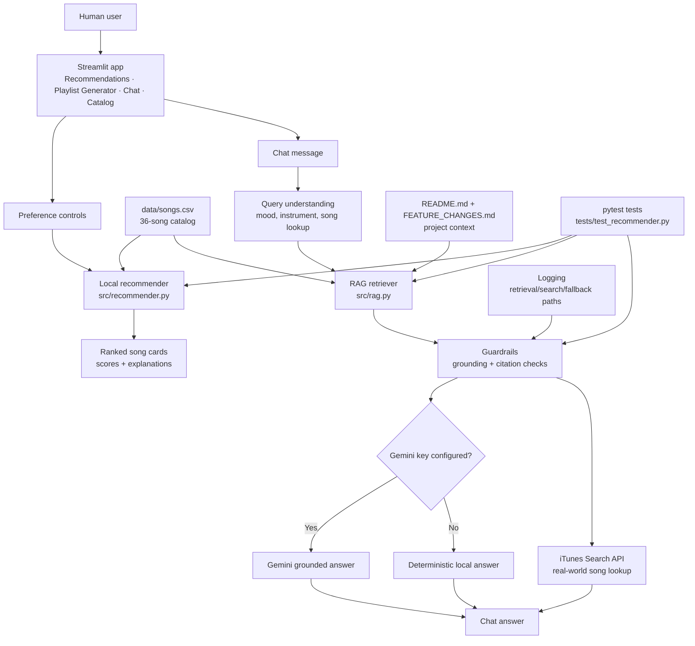
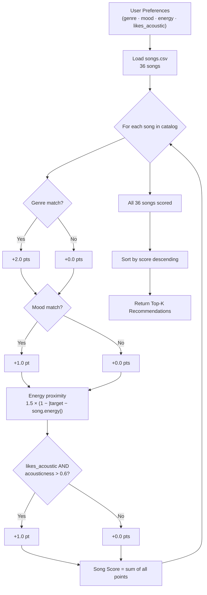

# Music Recommender Simulation

## Project Summary

This project is an explainable music recommendation app with a Streamlit interface, playlist presets, and a Chat assistant powered by retrieval-augmented generation (RAG). It helps a user find songs by genre, mood, energy, listening situation, instrument, or real-world song lookup while making the recommendation logic visible through scores and explanations.

The project matters because recommendation systems can feel like black boxes. This app keeps the recommendation pipeline inspectable: users can see which signals were used, developers can test the behavior, and the Chat feature is guarded so it retrieves context before answering instead of inventing unsupported results.

## Original Modules 1-3 Project

The original Modules 1-3 project was a command-line music recommender simulation. Its goal was to represent songs and user taste profiles as data, apply a weighted scoring rule, and return top recommendations from a small local catalog. The original version was useful for learning how recommendation scores work, but it had fixed inputs, terminal-only output, fewer catalog fields, and no AI chat or external retrieval.

This extension turns that starter recommender into a portfolio-style product:

- Browser-based Streamlit UI
- Expanded 36-song catalog
- Advanced filters and playlist presets
- Chat assistant with RAG over local project data
- External iTunes catalog search for real-world song lookup requests
- Tests, logging, and guardrails

---

## Architecture Overview

The app has two recommendation paths:

- **Structured recommender path:** UI preferences go into `recommend_songs()`, which scores every local song and returns ranked cards with explanations.
- **Chat/RAG path:** A user message goes through query understanding, local retrieval, optional Gemini generation, and external iTunes search when the local catalog cannot answer a real-world song lookup.



**Data flow:** user input -> Streamlit UI -> recommender or Chat pipeline -> local CSV/docs retrieval -> guarded answer or ranked results.

**Human and testing checks:** the user can inspect scores, reasons, catalog rows, and chat responses in the UI. Automated tests check ranking behavior, filters, playlist generation, RAG retrieval, guardrails, and external-search routing.

## How The System Works

Real streaming platforms like Spotify and YouTube use two main strategies to decide what to play next. **Collaborative filtering** looks across millions of users—if people with similar listening habits loved a song, the system predicts you will too. **Content-based filtering** ignores other users entirely and instead compares the attributes of songs you already like (genre, tempo, energy, mood) to every other song in the catalog, surfacing tracks that share those qualities. In practice, production systems blend both approaches. This simulation focuses exclusively on content-based filtering because it is simpler to reason about and does not require a large user database.

This version prioritizes **musical vibe** over popularity. A song scores well when its attributes are close to what the user asked for—matching genre earns the largest bonus, then mood, then proximity in energy level.

---

### Data Flow

```
INPUT                    PROCESS                         OUTPUT
─────────────────────    ─────────────────────────────   ────────────────────
UserProfile              For each of the 36 songs        Ranked list
  favorite_genre    ──►    score_song(user, song)   ──►  Top-K songs
  favorite_mood            └─ genre match check          with scores +
  target_energy            └─ mood match check           explanations
  likes_acoustic           └─ energy proximity
                           └─ acoustic bonus
                           Sort all scores ↓
```

---

### Song features

| Feature | Type | Role in scoring |
|---|---|---|
| `genre` | string | Primary signal — exact match awards +2.0 pts |
| `mood` | string | Emotional-context signal — exact match awards +1.0 pt |
| `energy` | float 0–1 | Proximity score — rewards closeness to target (up to +1.5 pts) |
| `valence` | float 0–1 | Positivity/happiness of the track; stored for future experiments |
| `danceability` | float 0–1 | Rhythmic drivability; useful for workout-profile experiments |
| `acousticness` | float 0–1 | Acoustic bonus (+1.0) when `likes_acoustic = True` and value > 0.6 |
| `tempo_bpm` | float | Beats per minute; stored for tempo-range experiments |
| `explicit` | bool | Used as a hard filter when clean recommendations are required |
| `popularity` | int 0-100 | Small ranking boost for broadly popular songs |
| `release_decade` | string | Optional preference for eras like 1990s, 2010s, or 2020s |
| `vocal_style` | string | Supports vocal vs instrumental preferences |
| `language` | string | Optional language preference |
| `artist_similarity` | string | Pipe-separated similar artists used for discovery boosts |

The catalog covers 10 genres (pop, lofi, rock, ambient, jazz, synthwave, indie pop, r&b, electronic, soul, classical, metal, country, hip-hop, reggae) and 11 moods (happy, chill, intense, relaxed, moody, focused, romantic, euphoric, nostalgic, melancholic, angry, peaceful, dreamy).

### UserProfile fields

| Field | Type | Meaning |
|---|---|---|
| `favorite_genre` | string | The genre the user listens to most |
| `favorite_mood` | string | The emotional mood they want right now |
| `target_energy` | float 0–1 | How energetic the music should feel |
| `likes_acoustic` | bool | Whether the user prefers acoustic over produced sound |

---

### Algorithm Recipe (Scoring Rule)

```
score(song) = genre_match  × 2.0      ← +2.0 if genres are equal, else 0
            + mood_match   × 1.0      ← +1.0 if moods are equal, else 0
            + (1 − |target_energy − song.energy|) × 1.5   ← energy proximity
            + acoustic_bonus × 1.0    ← only when likes_acoustic = True
                                         and song.acousticness > 0.6
```

**Why these weights?**
Genre is worth twice as much as mood because listeners tend to stay within a genre regardless of their current emotional state (you rarely listen to metal when you asked for jazz). Mood is a secondary filter within the genre space. Energy proximity is continuous so it naturally captures gradations—a song with 0.82 energy vs a target of 0.80 scores nearly the same as a perfect match, while a 0.20-energy song gets penalized heavily.

**Ranking Rule:** Every song in the catalog receives a score from the formula above. The recommender then sorts all scores in descending order and returns the top-k entries. The scoring rule answers "how good is *this* song?"—the ranking rule answers "which song is *best* relative to all others?"

---

### Mermaid Flowchart



---

### Expected Biases

- **Genre dominance**: Because a genre match is worth +2.0 and the max energy bonus is +1.5, any song in the right genre will almost always outscore a perfect-energy song in the wrong genre. A great lofi track could be buried below a mediocre pop track for a pop-preferring user.
- **Narrow mood vocabulary**: The system uses exact string matching for mood. A user who feels "happy" will not match songs tagged "euphoric" even though those moods are closely related.
- **Underrepresented genres**: The 36-song catalog is broader than the starter version, but some genres still have fewer examples than pop, lofi, and electronic. Users who prefer sparse genres may receive more energy-proximity runners-up.
- **Binary acoustic preference**: `likes_acoustic` is a yes/no flag. A user who "sort of" likes acoustic instruments has no way to express partial preference.

---

## Getting Started

### Setup

1. Create a virtual environment (optional but recommended):

```bash
python -m venv .venv
source .venv/bin/activate      # Mac or Linux
.venv\Scripts\activate         # Windows
```

2. Install dependencies

```bash
pip install -r requirements.txt
```

3. Run the app:

```bash
python -m src.main
```

4. Run the web app:

```bash
streamlit run src/app.py
```

The web UI has four tabs:

- **Recommendations:** choose genre, mood, energy, acoustic preference, explicit filtering, and advanced metadata preferences.
- **Playlist Generator:** generate workout, study, relaxing evening, or high-energy party playlists from preset constraints.
- **Chat:** ask for songs by mood, instrument, or listening situation; the app uses local catalog retrieval first and can search iTunes for real-world song lookups.
- **Catalog:** inspect the expanded song catalog and its richer features.

### Optional Gemini RAG Setup

The RAG retriever works without a Gemini key and will show the retrieved context as a fallback. To enable generated answers, rotate any key that has been shared publicly, then set a fresh key locally:

```bash
export GEMINI_API_KEY="your-new-key"
```

For Streamlit, you can also create `.streamlit/secrets.toml`:

```toml
GEMINI_API_KEY = "your-new-key"
```

Do not commit API keys. `.streamlit/secrets.toml` is ignored by git.

### External Song Search

The main recommender still scores the local `data/songs.csv` catalog so its behavior stays explainable and testable. The **Chat** tab can also call Apple's public iTunes Search API for real-world song lookup requests, such as "Find Boulevard of Broken Dreams from the internet." External results are shown as catalog search matches and are not scored with the local mood/energy formula.

## Sample Interactions

### 1. Structured recommendation

**Input:** In the Recommendations tab, choose `genre=pop`, `mood=happy`, `energy=0.80`, and allow explicit lyrics.

**Output:** The app returns ranked cards such as `Sunrise City` by Neon Echo near the top, with reasons like genre match, mood match, and close energy proximity. Each card exposes the score and the signals that contributed to it.

### 2. Chat with local RAG

**Input:**

```text
I want very dramatic music with violins.
```

**Output:**

```text
Based on this catalog, I would try:
- Rain on Glass by Arcana Strings [song-14]: a clean classical instrumental song with a melancholic mood, low energy, high acousticness, and inferred instrument tags including strings, violins, piano, and orchestral.
```

### 3. Chat with external search

**Input:**

```text
Find Boulevard of Broken Dreams from the internet.
```

**Output:**

```text
I could not answer that from the local 36-song project catalog, so I searched the iTunes music catalog and found:
- Boulevard of Broken Dreams by Green Day - American Idiot (Alternative, clean). Open in iTunes.
```

### 4. Guardrail behavior

**Input:**

```text
What instruments are used in a song that is not in the catalog?
```

**Output:** If the app cannot retrieve reliable local or external context, it returns a safe message saying it could not answer confidently instead of inventing details.

## Design Decisions

- **Local catalog first:** The core recommender uses `data/songs.csv` so scoring stays transparent, reproducible, and easy to test.
- **RAG in Chat:** Natural-language questions retrieve local song/project context before answering, which makes the Chat feature meaningfully change the app behavior instead of being a separate demo script.
- **Gemini is optional:** The app works without an API key through deterministic retrieval-based fallback. This keeps setup reproducible for graders or employers.
- **External search is separate from scoring:** iTunes lookup expands real-world song coverage, but those results are labeled as external catalog matches and are not mixed into the local weighted recommender.
- **Guardrails over guessing:** Gemini answers are accepted only when grounded in retrieved context. Unsupported questions get a clear failure response.

The main trade-off is scope versus explainability. A 36-song catalog is small, but it allows every recommendation to be audited. External search gives broader coverage, but it does not include the same mood/energy metadata, so those results are intentionally treated differently.

### Reliability, Logging, and Guardrails

- **Tests:** `tests/test_recommender.py` checks recommendation ordering, catalog loading, explicit filtering, playlist generation, RAG retrieval, grounded fallback behavior, outside-catalog guardrails, and external-search routing.
- **Guardrails:** Chat answers are grounded in retrieved chunks. Gemini responses are rejected if they do not cite retrieved context. If the app cannot answer from local or external sources, it says so instead of inventing a result.
- **Logging:** The app logs catalog loading, RAG retrieval decisions, Gemini generation attempts, external iTunes search attempts, external-search failures, and fallback paths.
- **Reproducibility:** The core recommender and local RAG fallback work without any API key. Gemini is optional through `GEMINI_API_KEY`.

## Testing Summary

Automated testing currently passes with `11 out of 11 tests passed`. The tests confirm that recommendations are sorted correctly, the expanded catalog loads with new fields, explicit filtering works, playlist generation returns ranked clean results, RAG retrieves relevant catalog context, outside-catalog questions are guarded, and external-search routing can be tested without depending on live network calls.

What worked well: local catalog retrieval is predictable, and the deterministic fallback makes the Chat usable even without Gemini. What needed adjustment: early RAG output exposed raw document chunks, so the retrieval path was changed to prioritize song chunks for music requests and reject weak answers. The biggest learning was that retrieval ranking matters as much as generation; if the wrong context wins, the answer will feel wrong even when the model is functioning.

Reliability improved after adding validation rules. Before the guardrails, a missing Gemini key caused the Chat to show raw retrieved project notes instead of a useful music answer. After the fix, music requests retrieve song chunks first, outside-catalog questions use iTunes search or return a safe failure message, and Gemini answers are rejected if they do not cite retrieved context.

Reliability snapshot:

| Check | Result |
|---|---|
| Automated tests | 11/11 passed |
| Missing Gemini key | App still works through deterministic local fallback |
| Missing local context | App says it could not answer or tries external search |
| Unsupported outside-catalog facts | Guarded instead of guessed |
| External API failure | Logged and handled with a safe no-result message |

### Rubric Alignment

| Requirement | How this project meets it |
|---|---|
| Useful AI behavior | Recommends music, explains matches, answers music questions, and searches real song metadata when needed |
| Retrieval-Augmented Generation | Chat retrieves catalog songs, playlist presets, and project docs before answering |
| Integrated into main app | RAG is part of the Streamlit **Chat** tab, not a standalone script |
| Reliability/testing | Automated tests cover recommender behavior, RAG retrieval, guardrails, and external-search routing |
| Logging/guardrails | Logging tracks retrieval/search paths; guardrails prevent unsupported or ungrounded answers |
| Clear setup | README includes install, run, test, optional Gemini, and external-search notes |

### Running Tests

Run the starter tests with:

```bash
pytest
```

You can add more tests in `tests/test_recommender.py`.

---

## CLI Output — Phase 4 Multi-Profile Evaluation

Running `python -m src.main` with four profiles + one experimental weight-shift run:

### Profile 1 — High-Energy Pop

```
============================================================
  PROFILE: High-Energy Pop
  genre=pop  mood=happy  energy=0.9
  [weights: genre=2.0 mood=1.0 energy=1.5]
============================================================

  Top recommendations:

    1. Sunrise City by Neon Echo
       Score : 4.38
       - genre match (+2.0)
       - mood match (+1.0)
       - energy proximity 0.92 (+1.38)

    2. Gym Hero by Max Pulse
       Score : 3.46
       - genre match (+2.0)
       - energy proximity 0.97 (+1.46)

    3. Rooftop Lights by Indigo Parade
       Score : 2.29
       - mood match (+1.0)
       - energy proximity 0.86 (+1.29)

    4. Storm Runner by Voltline
       Score : 1.48
       - energy proximity 0.99 (+1.48)

    5. Bass Drop Kingdom by XTRCT
       Score : 1.43
       - energy proximity 0.95 (+1.43)
```

**Observation:** Sunrise City is the clear #1 — genre, mood, and energy all match. Gym Hero is #2 even though its mood is "intense" not "happy", because the genre bonus (+2.0) outweighs the missing mood point. Storm Runner (rock) and Bass Drop Kingdom (electronic) sneak into 4th and 5th purely on energy proximity — the system has no candidates in the right genre+mood range left after the top 3.

---

### Profile 2 — Chill Lofi Study

```
============================================================
  PROFILE: Chill Lofi Study
  genre=lofi  mood=chill  energy=0.38
  [weights: genre=2.0 mood=1.0 energy=1.5]
============================================================

  Top recommendations:

    1. Library Rain by Paper Lanterns
       Score : 4.46
       - genre match (+2.0)
       - mood match (+1.0)
       - energy proximity 0.97 (+1.46)

    2. Midnight Coding by LoRoom
       Score : 4.44
       - genre match (+2.0)
       - mood match (+1.0)
       - energy proximity 0.96 (+1.44)

    3. Focus Flow by LoRoom
       Score : 3.47
       - genre match (+2.0)
       - energy proximity 0.98 (+1.47)

    4. Spacewalk Thoughts by Orbit Bloom
       Score : 2.35
       - mood match (+1.0)
       - energy proximity 0.90 (+1.35)

    5. Coffee Shop Stories by Slow Stereo
       Score : 1.48
       - energy proximity 0.99 (+1.48)
```

**Observation:** This profile works exactly as expected — the three lofi songs dominate the top 3. Coffee Shop Stories (jazz, relaxed, very low energy) edges into 5th place purely on energy closeness. Comparing to Profile 1: when the genre is well-represented in the catalog (3 lofi songs vs 2 pop songs), the top results feel more confident and the scores are tighter between #1 and #2.

---

### Profile 3 — Deep Intense Rock

```
============================================================
  PROFILE: Deep Intense Rock
  genre=rock  mood=intense  energy=0.93
  [weights: genre=2.0 mood=1.0 energy=1.5]
============================================================

  Top recommendations:

    1. Storm Runner by Voltline
       Score : 4.47
       - genre match (+2.0)
       - mood match (+1.0)
       - energy proximity 0.98 (+1.47)

    2. Gym Hero by Max Pulse
       Score : 2.50
       - mood match (+1.0)
       - energy proximity 1.00 (+1.5)

    3. Bass Drop Kingdom by XTRCT
       Score : 1.47
       - energy proximity 0.98 (+1.47)

    4. Iron Curtain by Scarred Earth
       Score : 1.44
       - energy proximity 0.96 (+1.44)

    5. Sunrise City by Neon Echo
       Score : 1.33
       - energy proximity 0.89 (+1.33)
```

**Observation:** Storm Runner is the only rock song, so it dominates at 4.47. The large score gap to #2 (2.50) reveals the **genre scarcity problem**: with only one rock song, the system fills the remaining slots with high-energy songs from unrelated genres. Gym Hero earns #2 by matching "intense" mood + perfect energy — it fits the emotional vibe even though it's pop, not rock.

---

### Profile 4 (Adversarial) — Peaceful Metal

```
============================================================
  PROFILE: Adversarial — Peaceful Metal (genre vs energy conflict)
  genre=metal  mood=peaceful  energy=0.2
  [weights: genre=2.0 mood=1.0 energy=1.5]
============================================================

  Top recommendations:

    1. Iron Curtain by Scarred Earth
       Score : 2.34
       - genre match (+2.0)
       - energy proximity 0.23 (+0.34)

    2. Porch Sunset by Dusty Miles
       Score : 2.14
       - mood match (+1.0)
       - energy proximity 0.76 (+1.14)

    3. Rain on Glass by Arcana Strings
       Score : 1.47
       - energy proximity 0.98 (+1.47)

    4. Spacewalk Thoughts by Orbit Bloom
       Score : 1.38
       - energy proximity 0.92 (+1.38)

    5. Library Rain by Paper Lanterns
       Score : 1.28
       - energy proximity 0.85 (+1.28)
```

**Observation — the key bias finding:** Iron Curtain (metal, angry, energy=0.97) is recommended to a user who asked for *peaceful, low-energy* music. The genre weight (+2.0) is so strong that even a terrible energy match (+0.34 out of a max +1.5) is enough to edge out Porch Sunset, which actually matches the user's mood and energy far better. This is the **genre dominance bias** in action.

---

### Experiment — Peaceful Metal with doubled energy weight

```
============================================================
  PROFILE: EXPERIMENT — Peaceful Metal  [genre=1.0  energy=3.0]
  genre=metal  mood=peaceful  energy=0.2
  [weights: genre=1.0 mood=1.0 energy=3.0]
============================================================

  Top recommendations:

    1. Porch Sunset by Dusty Miles
       Score : 3.28
       - mood match (+1.0)
       - energy proximity 0.76 (+2.28)

    2. Rain on Glass by Arcana Strings
       Score : 2.94
       - energy proximity 0.98 (+2.94)

    3. Spacewalk Thoughts by Orbit Bloom
       Score : 2.76
       - energy proximity 0.92 (+2.76)

    4. Library Rain by Paper Lanterns
       Score : 2.55
       - energy proximity 0.85 (+2.55)

    5. Coffee Shop Stories by Slow Stereo
       Score : 2.49
       - energy proximity 0.83 (+2.49)
```

**Experiment result:** Iron Curtain drops out of the top 5 entirely. Porch Sunset (country, peaceful, energy=0.44) becomes #1 because mood match + energy closeness now outweigh the single genre point. Rain on Glass (classical, melancholic, energy=0.22) rises to #2 — it has no matching genre or mood, but its energy is extremely close to the target (0.22 vs 0.20). The recommendations now *feel* more appropriate for a peaceful/low-energy user, even though the genre is completely wrong. This shows the trade-off: higher energy weight makes the system more acoustically accurate but genre-agnostic.

---

## Experiments You Tried

- **Weight shift (genre 2.0→1.0, energy 1.5→3.0):** The adversarial Peaceful Metal profile's top result changed from Iron Curtain (wrong energy, right genre) to Porch Sunset (right mood+energy, wrong genre). The system became more vibe-accurate but genre-blind.
- **Genre scarcity effect:** Profiles for underrepresented genres (rock, metal) showed large score gaps between #1 and #2. The single catalog entry for each genre dominates unconditionally.
- **Mood mismatch tolerance:** Gym Hero appears as a top-2 result for both "High-Energy Pop" (wrong mood: intense) and "Deep Intense Rock" (wrong genre: pop) — demonstrating that a single feature match plus energy proximity can beat no-match songs even across two different profiles.

---

## Limitations and Risks

- **Small catalog:** 36 songs is enough to demonstrate the logic and UI, but still not enough to mimic real streaming-scale variety. Sparse genres can still overfit to a small number of examples.
- **Genre dominance:** The genre weight (2.0) is large enough to push a wrong-energy song to the top of the list. The adversarial test proved this: an angry metal song at energy 0.97 ranked #1 for a user who asked for peaceful energy 0.2.
- **Synonym-blind mood matching:** "happy" and "euphoric" score identically to "happy" and "metal" — both return zero mood points. The system treats unrelated and closely related moods the same way.
- **No memory or feedback loop:** The system cannot learn from skips, replays, or likes. Every run starts fresh from the same static weights.
- **Filter bubble risk:** Nothing prevents five consecutive results from being the same genre. A user who casually typed "pop" as their preference can easily be locked into a pop-only list with no exposure to adjacent styles.

See [model_card.md](model_card.md) for a deeper analysis of each limitation.

---

## Reflection and Ethics

→ Full analysis in [model_card.md](model_card.md)

**Limitations and bias:** The system is limited by its small local catalog, exact-string mood labels, and hand-chosen weights. Genre is especially powerful, which can make the recommender overvalue a matching genre even when mood or energy is wrong. The external iTunes search also reflects what that catalog returns; it is useful for lookup, but it does not provide the same mood/energy metadata as the local dataset.

**Misuse prevention:** A user could misuse the Chat by treating it as a complete music knowledge source or assuming it knows every song's instruments, lyrics, or meaning. To reduce that risk, the app labels external results separately, refuses unsupported answers, rejects ungrounded Gemini responses, and keeps the local recommendation scores visible. API keys are also kept out of the repository through environment variables or Streamlit secrets.

**What surprised me during reliability testing:** The biggest surprise was that the first RAG version could retrieve technically relevant project documentation but still produce a bad user experience. For example, a study-music request returned feature-change notes instead of songs because document chunks outranked song chunks. Fixing that required better retrieval routing, not just a better prompt.

**Collaboration with AI:** AI assistance was helpful when designing the RAG pipeline: it suggested separating retrieval, prompt construction, Gemini generation, fallback behavior, and tests into focused functions. That made the system easier to verify. One flawed suggestion was assuming that once Gemini was connected, the answer quality problem would be solved. In practice, the issue was retrieval quality and grounding, so I had to test the outputs, notice the wrong context, and add song-first retrieval plus guardrails.

**Overall reflection:** Building this project made visible something that is easy to miss when using Spotify or YouTube: recommendations are the output of arithmetic and retrieval choices. A song rises to the top not because the system truly understands the listener, but because weights, filters, and retrieved context line up in a certain way. The project taught me that useful AI systems need more than generation; they need clear data boundaries, failure behavior, logging, and tests.
